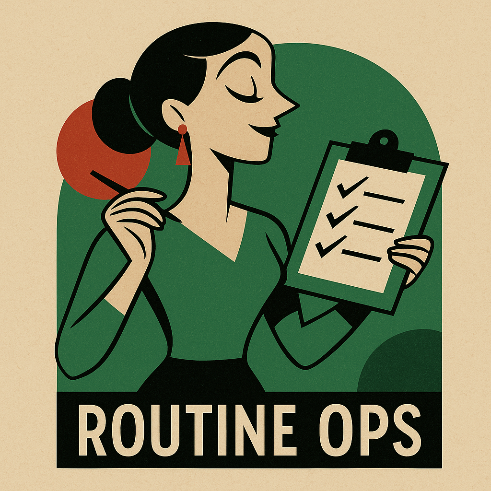

  
  <h1 align="center">Routine-Ops 🌟</h1>
  

    <em>Building an agentic workflow system for automated, scalable routine planning—from meal and ingredient management to exercise and habit tracking.</em>
  

---

## 📋 Project Board

  

---

## 🔧 Core Projects

| Repository                                                                        | Description                                                                                   | Badges                                                                                                                                                                                                                                                                                                                                                                               |
| --------------------------------------------------------------------------------- | --------------------------------------------------------------------------------------------- | ------------------------------------------------------------------------------------------------------------------------------------------------------------------------------------------------------------------------------------------------------------------------------------------------------------------------------------------------------------------------------------ |
| [routine-ops-plan-engine](https://github.com/routine-ops/routine-ops-plan-engine) | Agent workflow framework (Python & LangChain) for DSL generation and orchestration.           |    |
| [routine-ops-backend](https://github.com/routine-ops/routine-ops-backend)         | Spring Boot microservices & REST/GraphQL APIs for plan persistence (PostgreSQL, Hibernate 6). |                        |
| [routine-ops-ui](https://github.com/routine-ops/routine-ops-ui)                   | Next.js/React dashboard for daily checklists, cook instructions, and consistency reports.     |                                                 |

---
---

## 🛠️ How to Contribute

1. **Clone** the repository.
2. Create your feature branch (`git checkout -b feature/XYZ`).
3. **Commit** your changes (`git commit -m 'Add XYZ'`).
4. **Push** to the branch (`git push origin feature/XYZ`).
5. Open a **Pull Request**—we’ll review and merge!

*Read the full guidelines in each repo’s [CONTRIBUTING.md]([https://github.com/routine-ops/routine-ops-plan-engine/blob/main/CONTRIBUTING.md](https://github.com/routine-ops/.github/blob/main/CONTRIBUTING.md).*

---
## 🔄 Automated Updates

We use GitHub Actions (e.g. `github-update-readme`) to refresh stats, badges, and our blog feed on a schedule—keeping this page always up to date.

---

> “Empowering your daily routines through intelligent automation.”

  — The Routine-Ops Org Team

